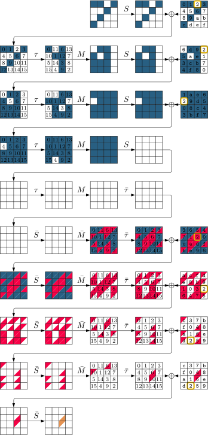
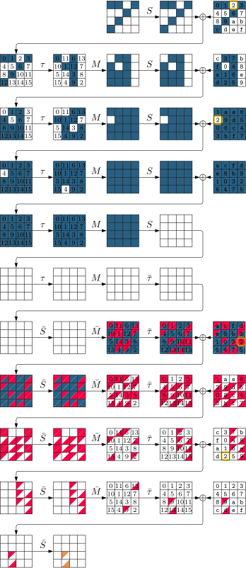

# Cryptanalysis of QARMAv2


This repository includes the source code of the tools we used in our paper accepted for ToSC 2024/1 ([FSE 2024](https://fse.iacr.org/2024/)): [Cryptanalysis of QARMAv2](https://tosc.iacr.org/index.php/ToSC/article/view/11406)


## Table of Contents

- [Cryptanalysis of QARMAv2](#cryptanalysis-of-qarmav2)
  - [Table of Contents](#table-of-contents)
  - [Requirements](#requirements)
  - [Installation](#installation)
  - [Structure of Our Tool](#structure-of-our-tool)
  - [Usage](#usage)
  - [Searching for Integral Distinguishers](#searching-for-integral-distinguishers)
    - [QARMAv2-64-128 ($\\mathscr{T} = 1$)](#qarmav2-64-128-mathscrt--1)
    - [QARMAv2-64-128 ($\\mathscr{T} = 2$)](#qarmav2-64-128-mathscrt--2)
    - [QARMAv2-128-256 ($\\mathscr{T} = 2$)](#qarmav2-128-256-mathscrt--2)
  - [Paper and Presentation](#paper-and-presentation)
  - [Disclaimer](#disclaimer)
  - [Citation](#citation)
  - [License ](#license-)


## Requirements

Our tool requires the following software:

- [Python3](https://www.python.org/downloads/) 
- [MiniZinc](https://www.minizinc.org/) to compile and solve our CP models
- [latexmk](https://www.latex-project.org/) to build the `.tex` file and generate the shapes of our attacks (can be replaced by just calling lualatex directly)

- [Or-Tools](https://developers.google.com/optimization)
 to solve our CP models.

## Installation

Many CP solvers are bundled with MiniZinc and can be used without any further installation. 
We use Or-Tools as the CP solver. 
Fortunately, `OR Tools CP-SAT` is bundled with MiniZinc after version 2.8.0. Thus, by installing the latest version of MiniZinc, one can use `OR Tools CP-SAT` without any further installation.
Additionally, we need the Python package named `minizinc` to work with MiniZinc in Python. 
To install the required software in Ubuntu, one can use the following commands:

```bash
apt update
apt upgrade
apt install python3-full
apt install git
apt install wget
cd /home 
wget https://github.com/MiniZinc/MiniZincIDE/releases/download/2.8.1/MiniZincIDE-2.8.1-bundle-linux-x86_64.tgz
tar -xvzf MiniZincIDE-2.8.1-bundle-linux-x86_64.tgz
mv MiniZincIDE-2.8.1-bundle-linux-x86_64 minizinc
rm MiniZincIDE-2.8.1-bundle-linux-x86_64.tgz
ln -s  /home/minizinc/bin/minizinc /usr/local/bin/minizinc
apt install python3-pip
python3 -m pip install minizinc
```

## Structure of Our Tool

Our tool's main components are the CP models saved in `.mzn` format, built using the methods explained in our paper. You can solve these `.mzn` files independently with MiniZinc.

To make using our tool even more convenient, we have included a Python interface for each application. Thus you'll discover `.mzn` files for each application, along with some handy Python tools.

## Usage

Using our tool is straightforward. Simply specify the number of attacked rounds or the length of distinguisher and choose the solver. Our tool will then identify the attack and visualize its shape.

For a quick guide on each application, run the following command:

```bash
python3 <application_name>.py --help
```

We provide examples for each application below.

## Searching for Integral Distinguishers

### QARMAv2-64-128 ($\mathscr{T} = 1$)

Assume that we want to search for a 9-round (ZC-based) integral distinguisher for QARMAv2-64-128 ($\mathscr{T}$ = 1) with a single tweak block. 
Navigate into [this folder](qarma-v2-64-t1/integral) and run the following command:

```bash
python3 distinguisherqarma64.py -RU 4 -RL 5 -KR 13
```

`RU`, and `RL` specify the number of forward and backward rounds, respectively, and `KR` specifies the number of rounds in the key recovery attack. 
The following field shows the output of running the above command on a regular laptop with an `11th Gen Intel(R) Core(TM) i7-1165G7 @ 2.80GHz` CPU and 16GB of RAM:

```bash
#######################################################
Searching for an integral distinguisher for Qarma-v2-64 with the following parameters
RU:              4
RL:              5
CP solver:       ortools
No. of threads:  8
Time limit:      4000
#######################################################
Elapsed time: 4.51 seconds
#######################################################
Distinguisher parameters:
Number of forwrd rounds:         04
Number of backward rounds:       05
Tweak cells that are active at most 01 times:
T[02] 
#######################################################
```

As can be seen, it takes about 4 seconds to find the distinguisher. 
Our tool also generates the `output.tex` file which contains the shape of the distinguisher in `Tikz` format. Run `latexmk -pdf ./output.tex` to see the shape of the distinguisher in `pdf` format:



### QARMAv2-64-128 ($\mathscr{T} = 2$)

As another example, you can navigat into [this folder](qarma-v2-64-t2) and run the following command to find a 10-round integral distinguisher for QARMAv2-64-128 ($\mathscr{T}$ = 2) with two independent tweak blocks:

```bash
python3 distinguisherqarma64.py -RU 5 -RL 5
```

The following field shows the output of running the above command:

```bash
#######################################################
Searching for an integral distinguisher for Qarma-v2-64 with the following parameters
RU:              5
RL:              5
CP solver:       ortools
No. of threads:  8
Time limit:      4000
#######################################################
Elapsed time: 4.40 seconds
#######################################################
Distinguisher parameters:
Number of forwrd rounds:         05
Number of backward rounds:       05
Tweak cells that are active at most 01 times:
T0[02] 
#######################################################

```

The following figure, generated by `latexmk -pdf ./output.tex`, shows the shape of the distinguisher in `pdf` format:



### QARMAv2-128-256 ($\mathscr{T} = 2$)

To find an integral distinguisher for 11 rounds of QARMAv2-128-256 ($\mathscr{T}$ = 2) with two independent tweak blocks, navigate into [this folder](qarma-v2-128-t2) and run the following command:

```bash
python3 distinguisherqarma128.py -RU 5 -RL 6 
```

The following fied shows the output of running the above command:

```bash
#######################################################
Searching for an integral distinguisher for Qarma-v2-128 with the following parameters
RU:              5
RL:              6
CP solver:       ortools
No. of threads:  8
Time limit:      4000
#######################################################
Elapsed time: 14.26 seconds
#######################################################
Distinguisher parameters:
Number of forwrd rounds:         05
Number of backward rounds:       06
Tweak cells that are active at most 01 times:
T0[11] 
#######################################################
```

The following figure, generated by `latexmk -pdf ./output.tex`, shows the shape of the distinguisher in `pdf` format:


---
## Paper and Presentation

To see the details about our method, please refer to our [paper](https://ia.cr/2023/1701). 
We present this work in [FSE 2024](https://fse.iacr.org/2024/):

- [Video](https://youtu.be/ik-jy0r2NHA?t=1407)
- [Slides](https://iacr.org/submit/files/slides/2024/fse/fse2024/2024_1_42/slides.pdf)
- [Latex Sources of Our Slides](https://github.com/hadipourh/talks/tree/main/20240328-FSE-2024)
- [Full Version of Paper](https://ia.cr/2023/1833)

If you have any questions or comments, please feel free to open an issue in this repository or reach out to [Hosein Hadipour](mailto:hsn.hadipour@gmail.com) directly.

## Disclaimer

The solvers used in this tool are not entirely deterministic and may generate different outputs based on the configuration of the host machine. 
In addition, the same problem can have multiple optimal solutions.

Please note that we have only verified the attacks documented in our paper. 
Therefore, it is essential to thoroughly review and validate any output of the tool before making claims related to our paper. We hope this tool is useful for the community.

---
## Citation

If you use our tool in your work, please acknowledge it by citing our paper:

```
@article{DBLP:journals/tosc/HadipourT24,
  author       = {Hosein Hadipour and
                  Yosuke Todo},
  title        = {Cryptanalysis of QARMAv2},
  journal      = {{IACR} Trans. Symmetric Cryptol.},
  volume       = {2024},
  number       = {1},
  pages        = {188--213},
  year         = {2024},
  url          = {https://doi.org/10.46586/tosc.v2024.i1.188-213},
  doi          = {10.46586/TOSC.V2024.I1.188-213},
  timestamp    = {Tue, 26 Mar 2024 13:06:22 +0100}
}
```
---
## License 

This project is licensed under the MIT License - see the [LICENSE](LICENSE) file for details.
